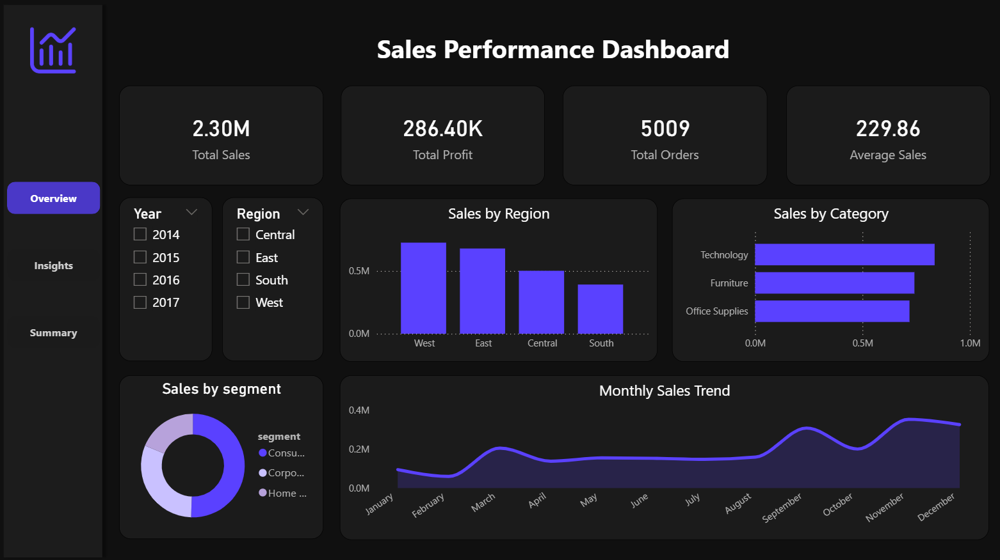
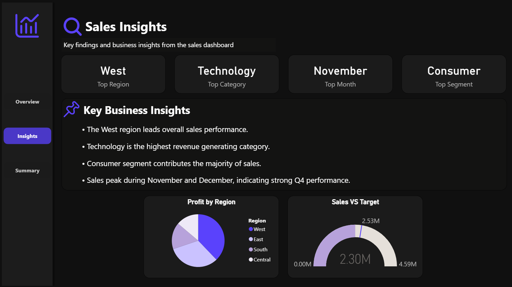
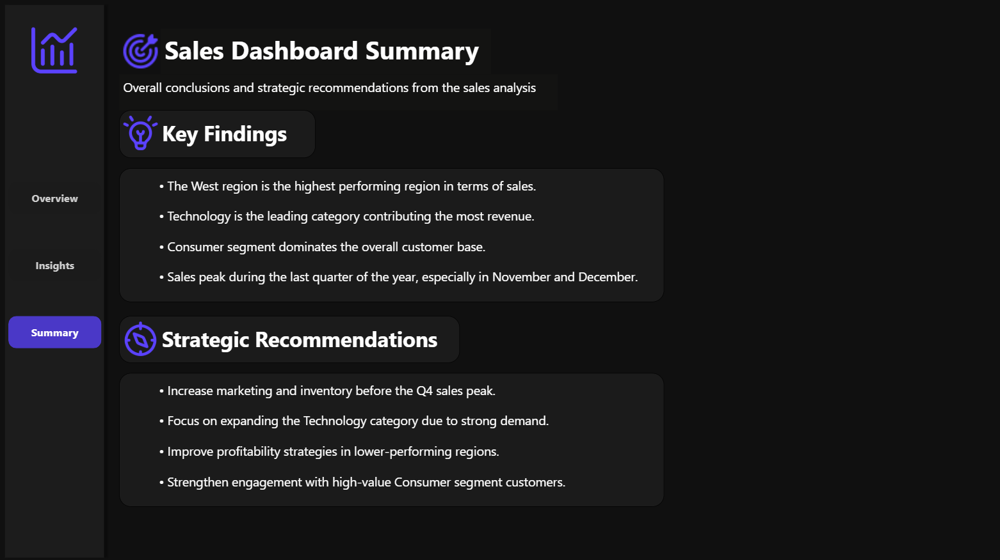

# 📊 Sales Performance Dashboard (Power BI)

## 📌 Project Overview
This project presents an **interactive Sales Performance Dashboard** built using **Power BI**.  
The dashboard analyzes sales performance across regions, categories, and customer segments while highlighting key insights and business recommendations.

The goal of this project is to demonstrate **data analysis, visualization, and storytelling skills** through a structured dashboard consisting of **Overview, Insights, and Summary sections**.

---

## 🛠 Tech Stack
- **Power BI** – Data visualization and dashboard creation  
- **Python (Pandas, NumPy)** – Data preprocessing and analysis  
- **CSV Dataset** – Sales dataset used for analysis  

---

## 📷 Dashboard Screenshots

### Overview Page

This page provides a high-level summary of sales performance including:
- Key performance indicators (Sales, Profit, Orders)
- Sales trends over time
- Sales distribution by region and category

---

### Insights Page

This page highlights key business insights such as:
- Top performing region, category, and segment
- Profit distribution by region
- Key observations derived from the data

---

### Summary Page

This section summarizes the overall findings and provides **strategic recommendations** based on the analysis.

---

## 🔍 Key Insights
- The **West region** generates the highest overall sales.
- **Technology** is the top-performing category in terms of revenue.
- The **Consumer segment** contributes the largest share of total sales.
- Sales tend to **peak during the fourth quarter**, particularly in November and December.

---

## 🎯 Strategic Recommendations
- Increase marketing and inventory before the **Q4 sales peak**.
- Focus on expanding the **Technology category** due to strong demand.
- Improve profitability strategies in **lower-performing regions**.
- Strengthen engagement with **high-value Consumer segment customers**.

---

## 👨‍💻 Author
**Lakshya Sharma**

- GitHub: https://github.com/slakshya-22  
- LinkedIn: https://www.linkedin.com/in/slakshya22/

---
